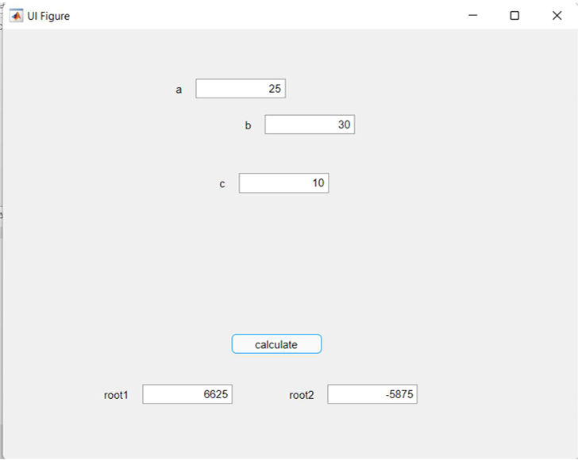

# Quadratic Equation Solver — MATLAB App Designer

**Course:** Application Development 1 · III Year Semester 1 · 2022
**Institution:** MRCET, Department of Aeronautical Engineering
**Guide:** Mrs. L. Sushma, Associate Professor

---

## Problem statement

Solves the general quadratic equation **ax² + bx + c = 0** for any
real coefficients a, b, c. Handles all three cases — two distinct real
roots, one repeated root, and complex conjugate roots — with clear
status messages distinguishing each case.

## Features

- Input validation — detects a=0 (linear, not quadratic)
- Discriminant calculation with display
- Two distinct real roots (D > 0) using quadratic formula
- Repeated root (D = 0)
- Complex roots (D < 0) — displays real and imaginary parts
- Clear button to reset all fields
- Colour-coded status messages (green/blue/orange/red)

## How to run

1. Open MATLAB (R2020a or later)
2. Navigate to this folder
3. Type `qadeqn` in the MATLAB command window
4. The App Designer GUI will open

## Enhancement over original

The original course submission used the simplified formula from the
project report. This enhanced version adds:
- Correct quadratic formula: x = (−b ± √(b²−4ac)) / 2a
- Discriminant display
- Complex root handling
- Input validation for a=0
- Clear button and status label

## Screenshot

