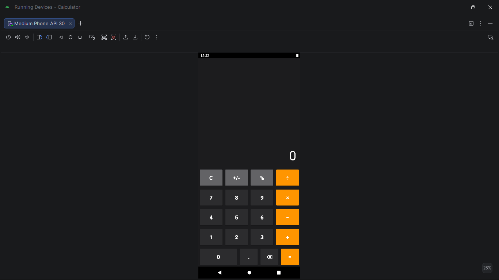
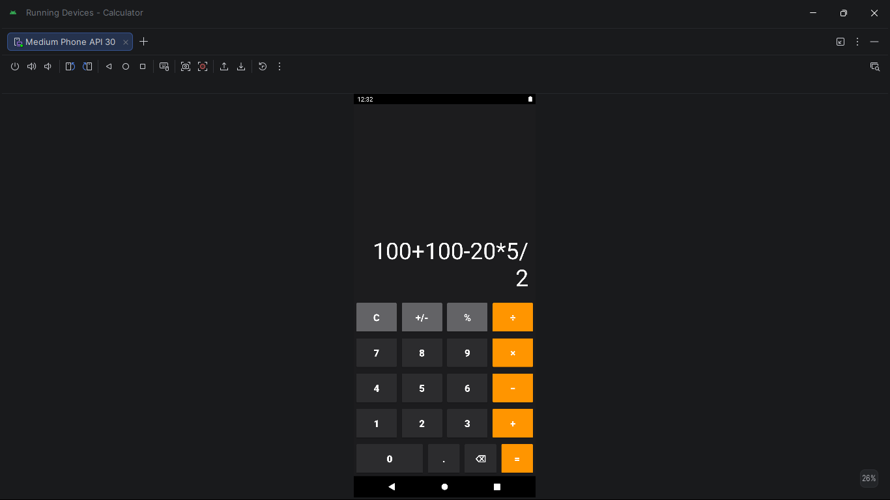
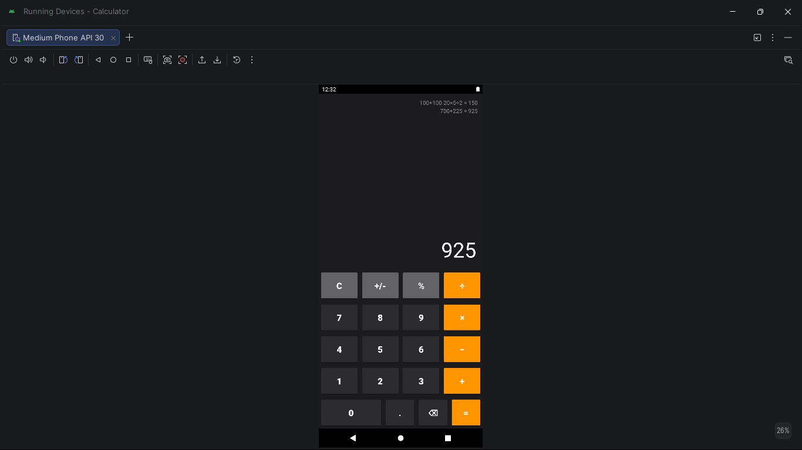

# Calculator App — Android Studio (Java)

**Course:** Application Development 2 · III Year Semester 2 · 2022–2023
**Institution:** MRCET, Department of Aeronautical Engineering
**Guide:** Mrs. L. Sushma, Associate Professor

---

## Problem statement

A fully functional Android calculator supporting full arithmetic
expression evaluation with operator precedence, calculation history,
and robust error handling — built using Java and Android Studio.

---

## App screenshots

| UI | Expression | Result | History |
|---|---|---|---|
|  |  |  |  |

---

## Features

- Full expression evaluation — e.g. `100+100-20×5÷2 = 150`
- Operator precedence: × and ÷ evaluated before + and −
- Recursive descent parser — handles nested operations correctly
- Decimal point with duplicate prevention per number segment
- Percentage button (value ÷ 100)
- Sign toggle (+/-)
- Backspace (⌫) to delete last character
- Division by zero detection with error message on display
- Calculation history — previous results shown above display
- Dark iOS-style UI — black background, orange operators

---

## UI layout

```
┌─────────────────────────────┐
│  history log (scrollable)   │
│  100+100 20×5÷2 = 150       │
│  700+225 = 925              │
├─────────────────────────────┤
│                         150 │  ← display
├──────┬──────┬──────┬────────┤
│  C   │ +/-  │  %   │   ÷   │  ← gray / orange
├──────┼──────┼──────┼────────┤
│  7   │  8   │  9   │   ×   │
├──────┼──────┼──────┼────────┤
│  4   │  5   │  6   │   −   │
├──────┼──────┼──────┼────────┤
│  1   │  2   │  3   │   +   │
├────────────┬──────┬─────────┤
│     0      │  .   │  ⌫  │   =  │
└────────────┴──────┴─────────┘
```

---

## How to open in Android Studio

1. Open Android Studio
2. File → Open → select this `calculator-app/` folder
3. Wait for Gradle sync to complete
4. Connect device or start emulator → click Run ▶

**Language:** Java · **Min SDK:** API 23 · **Target SDK:** API 33