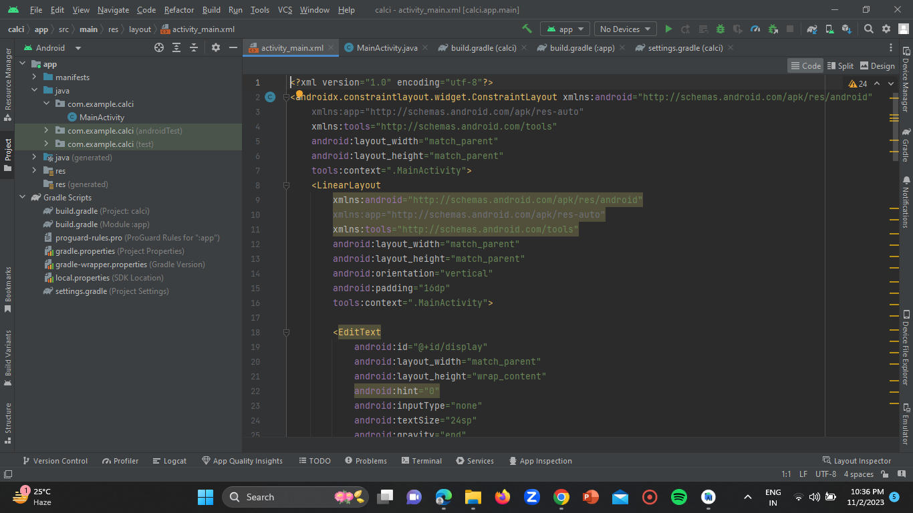
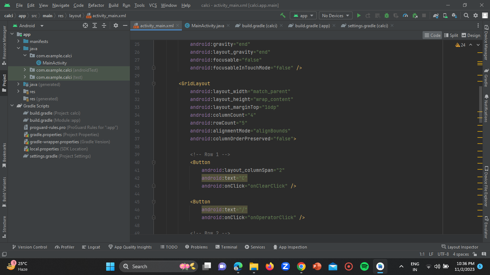
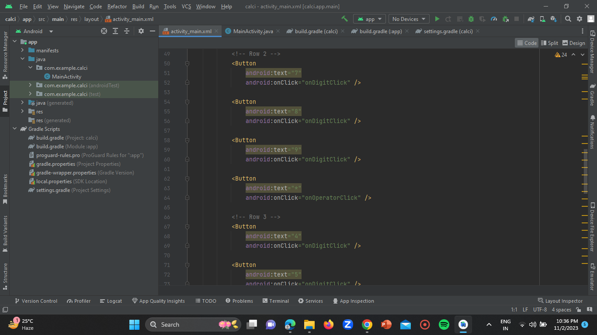

# Calculator App — Android Studio (Java)

**Course:** Application Development 2 · III Year Semester 2 · 2022–2023
**Institution:** MRCET, Department of Aeronautical Engineering
**Guide:** Mrs. L. Sushma, Associate Professor

---

## Problem statement

A fully functional Android calculator app supporting full arithmetic
expression evaluation, calculation history, and robust error handling
— built using Java and Android Studio.

---

## Features

- Full expression evaluation (e.g. `12 + 3 × 4 - 1`)
- Operator precedence: × and ÷ before + and −
- Decimal point with duplicate prevention
- Percentage button (value ÷ 100)
- Sign toggle (+/-)
- Backspace (⌫) to delete last character
- Division by zero error handling
- Calculation history — last 5 results displayed
- Dark iOS-style UI (black background, orange operators)

---

## App screenshots

| Calculator UI | Calculation | History |
|---|---|---|
|  |  |  |

---

## Project structure

```
calculator-app/
├── app/src/main/
│   ├── java/com/mrcet/calculator/
│   │   └── MainActivity.java   ← Expression evaluator + button logic
│   ├── res/layout/
│   │   └── activity_main.xml   ← Button grid + display
│   └── AndroidManifest.xml
└── screenshots/
```

---

## How to open in Android Studio

1. File → Open → select `calculator-app/` folder
2. Wait for Gradle sync
3. Run on device or emulator (API 21+)

**Language:** Java · **Min SDK:** API 21 · **Target SDK:** API 33