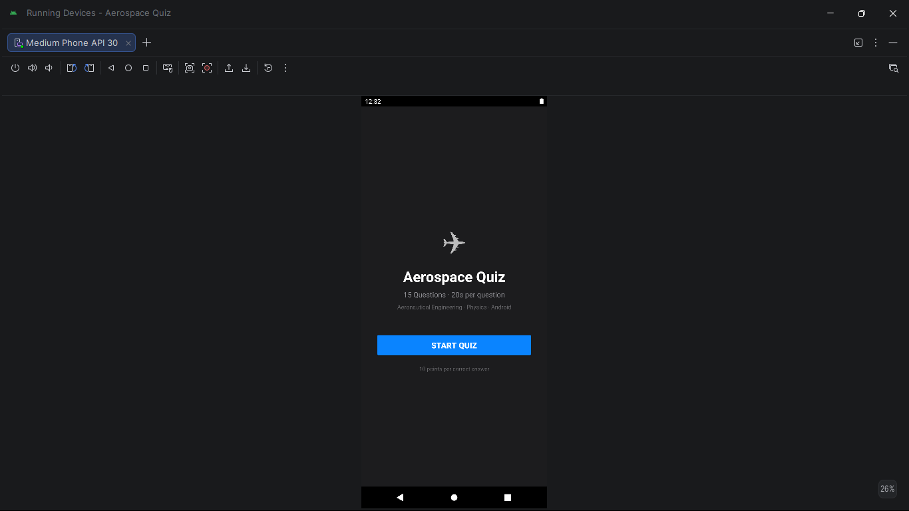
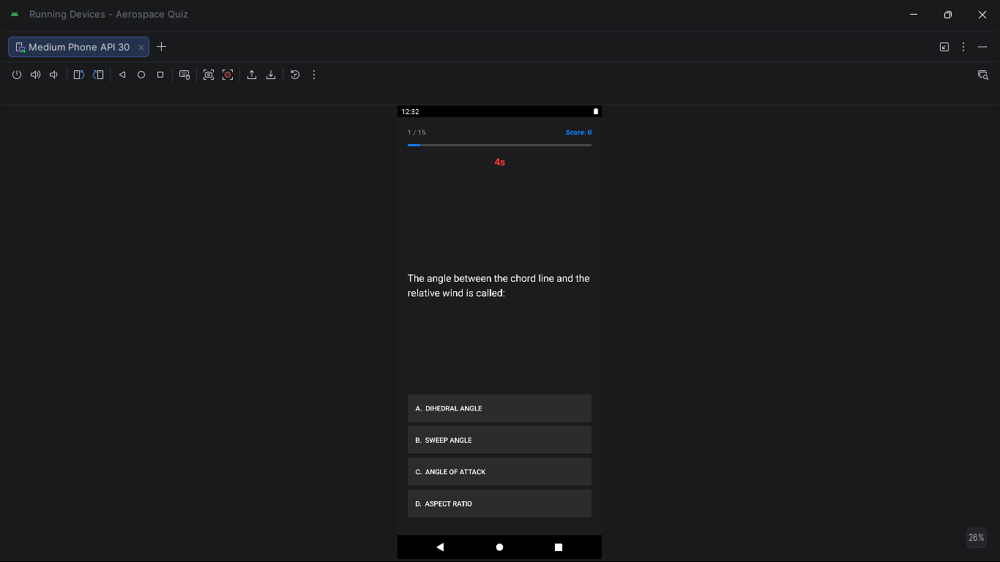
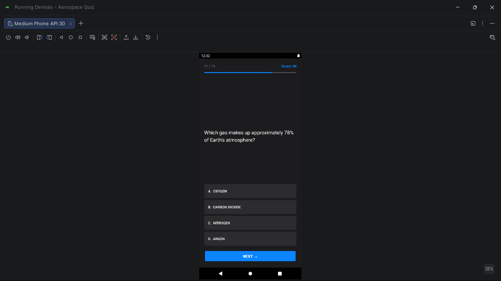
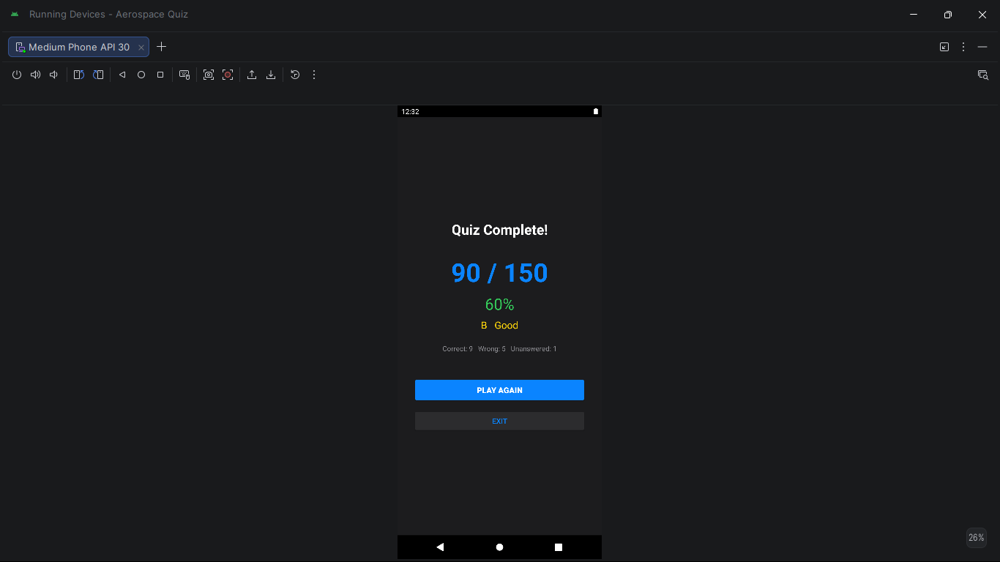

# Aerospace Quiz App — Android Studio (Java)

**Course:** Application Development 2 · III Year Semester 2 · 2022–2023
**Institution:** MRCET, Department of Aeronautical Engineering
**Guide:** Mrs. L. Sushma, Associate Professor

---

## Problem statement

A multiple-choice quiz app covering aerospace engineering, physics,
and Android development fundamentals. Features a countdown timer,
colour-coded answer feedback, score tracking, and a results screen
with grade calculation — built using Java and Android Studio.

---

## App screenshots

| Welcome | Question + Timer | Answer feedback | Results |
|---|---|---|---|
|  |  |  |  |

---

## Features

- 15 questions across aerospace, physics and Android topics
- Questions shuffled randomly each session
- 20-second countdown timer per question
- Timer turns red when ≤ 5 seconds remain
- Auto-advance on timeout — marked as unanswered
- Green highlight for correct answer
- Red highlight for wrong answer — correct also shown green
- Progress bar showing position through quiz
- Score: 10 points per correct answer (150 max)
- Results screen: score, percentage, A+/A/B/C/D grade, breakdown
- Play Again restarts with reshuffled questions

---

## Question categories

| Category | Count |
|---|---|
| Aeronautical Engineering (VTOL, control surfaces, Mach, AoA) | 8 |
| Physics and Engineering (Newton's laws, SI units, atmosphere) | 4 |
| Android / Technology | 3 |

---

## Grade scale

| Score % | Grade |
|---|---|
| ≥ 90% | A+ — Excellent |
| ≥ 75% | A  — Very Good |
| ≥ 60% | B  — Good |
| ≥ 40% | C  — Average |
| < 40% | D  — Needs Improvement |

---

## Project structure

```
quiz-app/
├── app/src/main/
│   ├── java/com/mrcet/quizapp/
│   │   ├── MainActivity.java    ← Welcome screen
│   │   ├── QuizActivity.java    ← Quiz engine, timer, scoring, results
│   │   ├── Question.java        ← Data model
│   │   └── QuestionBank.java    ← 15 aerospace/science questions
│   ├── res/layout/
│   │   ├── activity_main.xml    ← Welcome screen
│   │   ├── activity_quiz.xml    ← Quiz screen
│   │   └── activity_results.xml ← Results screen
│   └── AndroidManifest.xml
└── screenshots/
```

---

## How to open in Android Studio

1. File → Open → select this `quiz-app/` folder
2. Wait for Gradle sync
3. Run on device or emulator (API 23+)

**Language:** Java · **Min SDK:** API 23 · **Target SDK:** API 33