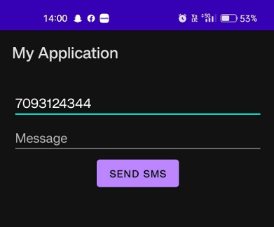

# SMS Sending App using Android Intent

**Course:** Application Development 2 · III Year Semester 2 · 2022–2023
**Institution:** MRCET, Department of Aeronautical Engineering
**Guide:** Mrs. L. Sushma, Associate Professor

---

## Problem statement

Demonstrates Android's Intent system by building an SMS sending
application that allows users to compose and send SMS messages through
the device's default messaging application. Uses `Intent.ACTION_VIEW`
with a `smsto:` URI to pre-fill the recipient and message body.

---

## Features

- Phone number input with format validation
- Multi-line message composition field
- Input validation with inline error messages
- Clear button to reset all fields
- Resolves default SMS app availability before firing Intent
- Exception handling for devices without SMS capability

---

## App screenshots

| Empty state | Number entered | Message composed | SMS app opened |
|---|---|---|---|
|  |  |  |  |

---

## How it works

```
User enters phone number + message
            │
            ▼
    Input validation
            │
            ▼
    Intent(ACTION_VIEW)
    URI: smsto:<phoneNumber>
    Extra: sms_body = <message>
            │
            ▼
    Android routes to default SMS app
    (pre-filled with number + message)
            │
            ▼
    User confirms and sends
```

---

## Project structure

```
sms-intent-app/
├── app/src/main/
│   ├── java/com/mrcet/smsapp/
│   │   └── MainActivity.java     ← Core intent logic + validation
│   ├── res/layout/
│   │   └── activity_main.xml     ← UI layout
│   └── AndroidManifest.xml       ← SEND_SMS permission
└── screenshots/                  ← App running on real device
```

---

## How to open in Android Studio

1. Open Android Studio
2. File → Open → select `sms-intent-app/` folder
3. Wait for Gradle sync to complete
4. Connect device or start emulator
5. Click Run ▶

**Minimum SDK:** API 21 (Android 5.0 Lollipop)
**Target SDK:** API 33 (Android 13)
**Language:** Java

---

## Key concepts demonstrated

- **Android Intent system** — inter-app communication via intents
- **URI scheme** — `smsto:` URI for SMS pre-fill
- **Input validation** — regex-based phone number check
- **Activity lifecycle** — `onCreate()`, `setContentView()`
- **View binding** — `findViewById()` pattern
- **AndroidManifest** — permission declaration

---

## Enhancement over original submission

The original course submission (documented in `docs/`) implemented
the basic `sendSms()` method. This enhanced version adds:
- Phone number format validation (regex)
- Empty field detection with inline errors
- Clear button
- SMS app availability check before intent
- Exception handling with user feedback