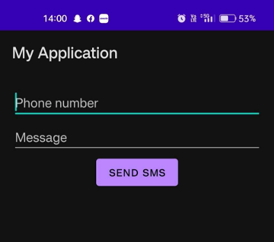
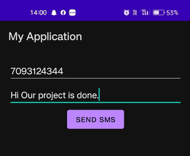
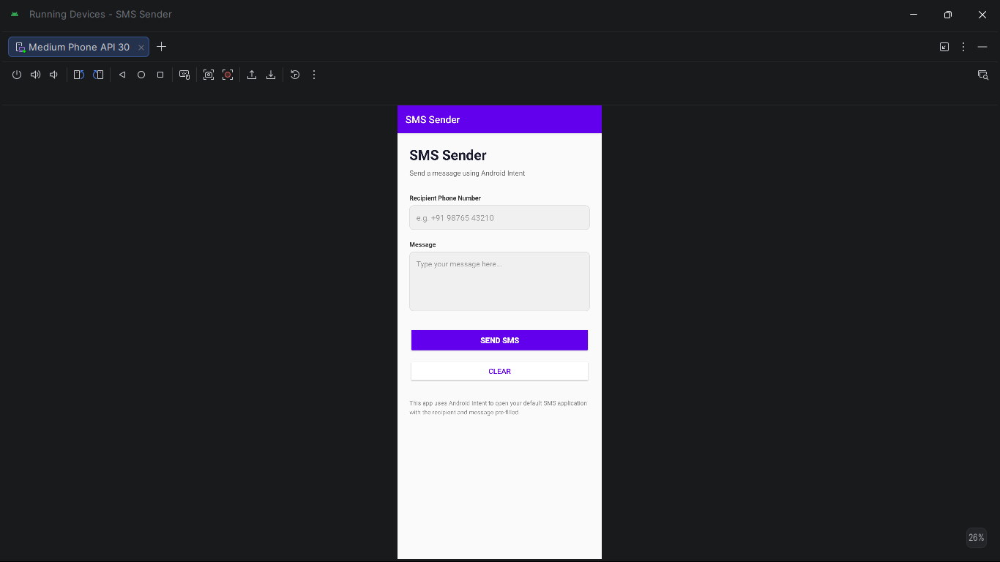
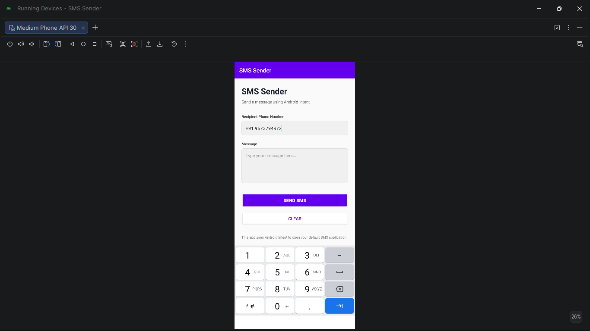
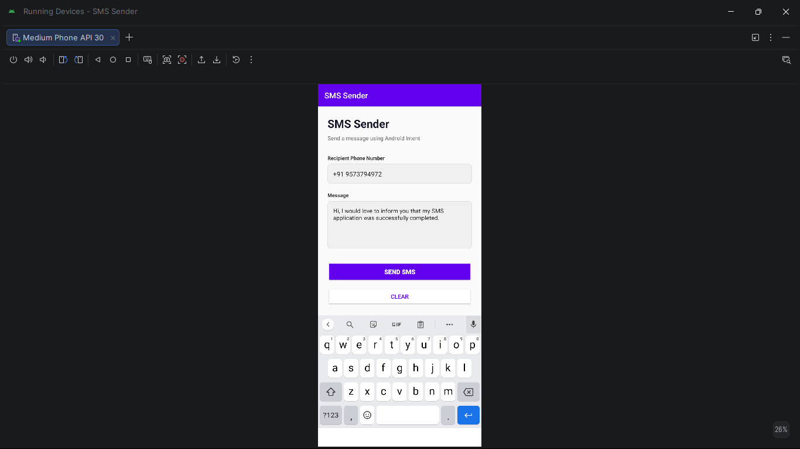

# SMS Sending App using Android Intent

**Course:** Application Development 2 · III Year Semester 2 · 2022–2023
**Institution:** MRCET, Department of Aeronautical Engineering
**Guide:** Mrs. L. Sushma, Associate Professor

---

## Problem statement

Demonstrates Android's Intent system by building an SMS sending
application that pre-fills the device's default messaging app with
a recipient phone number and message body. Two versions are maintained:
v1 (original course submission) and v2 (enhanced with validation).

---

## Version comparison

| Feature | v1 — Original | v2 — Enhanced |
|---|---|---|
| Intent firing | ✅ | ✅ |
| Input validation | ❌ | ✅ Regex + empty check |
| Clear button | ❌ | ✅ |
| SMS app availability check | ❌ | ✅ resolveActivity() |
| Exception handling | ❌ | ✅ |
| Full Gradle project | ❌ Source only | ✅ Runnable in Android Studio |

---

## v1 — Original course submission

Source code from the App Development 2 project report (2022–23).
Three files reconstructed from the submitted report.

### Screenshots — real device demonstration

| UI | Phone number entered | Message composed |
|---|---|---|
|  |  |  |

### How it works

```java
Intent smsIntent = new Intent(Intent.ACTION_VIEW);
smsIntent.setData(Uri.parse("smsto:" + phoneNumber));
smsIntent.putExtra("sms_body", message);
startActivity(smsIntent);
```

---

## v2 — Enhanced Android Studio project

Full runnable Android Studio project with all Gradle files,
resource files, and enhanced features.

### Screenshots — emulator run

| UI | Validation | SMS app launched |
|---|---|---|
|  |  |  |

### Enhancements over v1

- Phone number regex validation: `[+\d\s\-()] 7–15 chars`
- Inline EditText error messages for empty/invalid fields
- `resolveActivity()` check before firing intent
- Clear button with Toast confirmation
- Exception handling with user feedback

---

## How to open v2 in Android Studio

1. File → Open → select `v2-enhanced/` folder
2. Wait for Gradle sync
3. Run on device or emulator (API 23+)

**Permission required:** `android.permission.SEND_SMS`
**Language:** Java · **Min SDK:** API 23