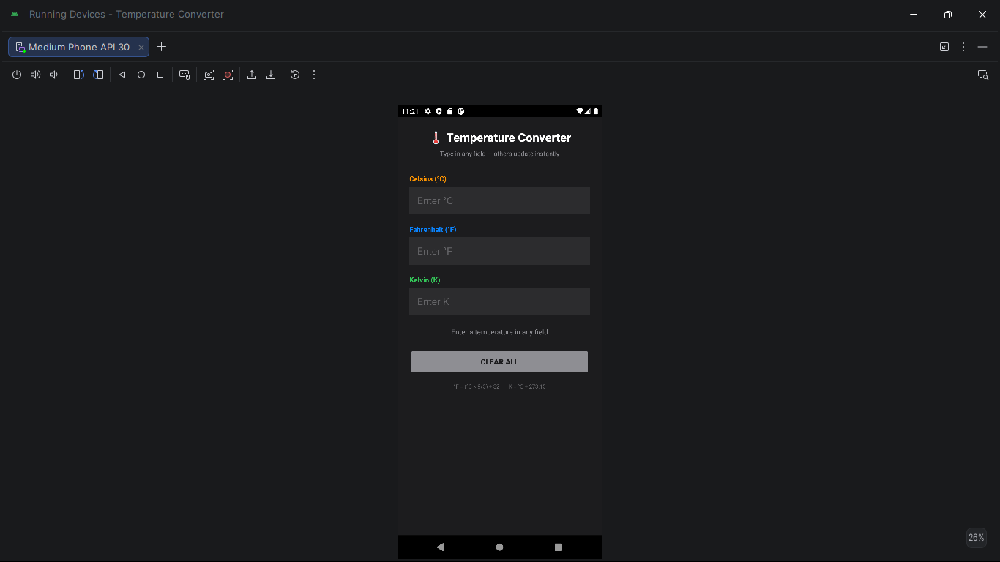
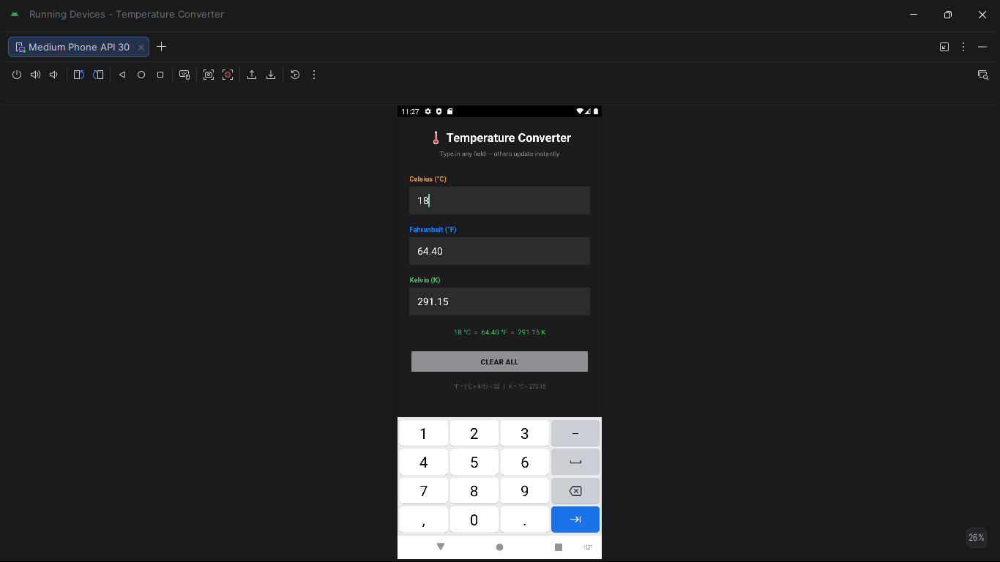

# Temperature Converter App — Android Studio (Java)

**Course:** Application Development 2 · III Year Semester 2 · 2022–2023
**Institution:** MRCET, Department of Aeronautical Engineering
**Guide:** Mrs. L. Sushma, Associate Professor

---

## Problem statement

Real-time temperature converter between Celsius, Fahrenheit and Kelvin.
Type in any field and the other two update instantly — no button press
required. All six conversion directions supported with physical limit
validation.

---

## App screenshots

| UI | Celsius input | Fahrenheit input | Kelvin input |
|---|---|---|---|
|  |  |  |  |

---

## Conversion formulas

| From | To Fahrenheit | To Kelvin |
|---|---|---|
| Celsius | °F = (°C × 9/5) + 32 | K = °C + 273.15 |
| Fahrenheit | — | K = (°F − 32) × 5/9 + 273.15 |
| Kelvin | °F = (K − 273.15) × 9/5 + 32 | — |

---

## Features

- Real-time conversion via TextWatcher — updates as you type
- All 6 directions: C→F, C→K, F→C, F→K, K→C, K→F
- Physical limit validation:
  - Below −273.15 °C → error (absolute zero)
  - Below −459.67 °F → error
  - Negative Kelvin → error
- Clear All button resets all three fields
- `isUpdating` flag prevents recursive TextWatcher loops
- Conversion formula reminder at bottom of screen

---

## How to open in Android Studio

1. Open Android Studio
2. File → Open → select this `temperature-converter/` folder
3. Wait for Gradle sync to complete
4. Connect device or start emulator → click Run ▶

**Language:** Java · **Min SDK:** API 23 · **Target SDK:** API 33